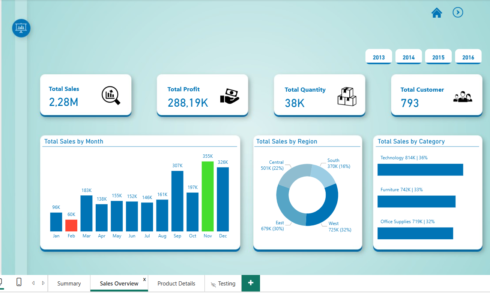

# Sales Performance Dashboard

## Project Overview
Interactive Power BI dashboard analysing sales performance, revenue trends, and business unit performance.

## Tools Used
- Power BI
- DAX
- Data Modeling
- Excel

## Dashboard Preview

## Live Dashboard
🔒 Interactive version available upon request (restricted by Power BI tenant settings)

👉 Contact me or request access to view the full dashboard

## Key Insights
- Revenue trends over time
- Profit performance analysis
- Business unit comparison
- KPI monitoring dashboard

## Files Included
- Sales Report.pbix
- SalesData.xlsx
- Dashboard Screenshot
